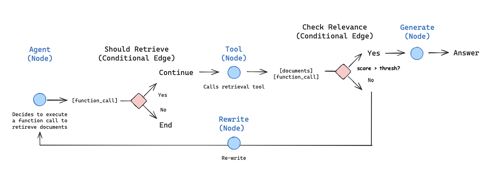

# Agentic RAG — AI Financial Research Assistant

This project is a production-minded prototype of an agentic RAG chatbot implemented with LangGraph and OpenAI APIs (model: openai:gpt-5-nano). It uses an in-memory FAISS vector store (can be cached for faster startup) and LangGraph best-practices: ToolNodes, conditional edges, and a retriever tool.

Features:
- Chat UI (LangSmith Studio)
- Upload documents in parallel through `ingest_data.py` script (recommended for production) or automatically loads documents on startup and index them into FAISS
- Agent responder decides whether to retrieve or answer directly using a router node
- Agent grader grades its own responses and retries if the grade is low (threshold configurable)
- Retrieval path returns provenance (source, snippet)
- Unit tests + integration test included (pytest)

## 🏗️ Agent Workflow


*Adapted from https://langchain-ai.github.io/langgraph/tutorials/rag/langgraph_agentic_rag/*

## 🚀 Quick Start

### First Time Setup
```bash
# 1. Ingest and cache your data
VECTORSTORE_CACHE_PATH=./data/vectorstore python ingest_data.py

# 2. Start the server (uses cache automatically)
langgraph dev
```

### Daily Usage
```bash
# Uses cached vectorstore (fast!)
langgraph dev
```

### Update Data
```bash
# Reload data and update cache
VECTORSTORE_CACHE_PATH=./data/vectorstore python ingest_data.py --force-reload
```

## ⚙️ Configuration

### Environment Variables
```bash
# Disable cache (force reload every time)
USE_VECTORSTORE_CACHE=false langgraph dev

# Enable cache (default)
USE_VECTORSTORE_CACHE=true langgraph dev
```

### Ingestion Options
```bash
# Standard ingestion
python ingest_data.py

# Don't save to cache
python ingest_data.py --no-save

# Skip test query
python ingest_data.py --no-test

# Force reload from files
python ingest_data.py --force-reload
```

### Custom Parameters (in code)
```python
from src.agent.utils import ingest_files_from_list

# Optimize for your use case
ingest_files_from_list(
    "data/files.txt",
    vectorstore,
    chunk_size=1000,      # Text chunk size
    chunk_overlap=200,    # Overlap between chunks
    batch_size=100,       # Documents per batch
    max_workers=4,        # Parallel file loaders
)
```

## 🎯 Tuning Guide

### Many Small Files (10-100 files)
```python
max_workers=8      # More parallelism
batch_size=50      # Smaller batches
chunk_size=1000    # Standard chunks
```

### Few Large Files (1-5 large PDFs)
```python
max_workers=2      # Less parallelism
batch_size=200     # Larger batches
chunk_size=1500    # Bigger chunks
```

### Memory Constrained
```python
max_workers=2      # Minimal parallelism
batch_size=50      # Small batches
chunk_size=500     # Smaller chunks
```

## 🐛 Troubleshooting

### Slow Performance
1. Check if cache exists: `ls -lh data/vectorstore/`
2. Verify cache is enabled: `USE_VECTORSTORE_CACHE=true`
3. Increase workers: Edit `max_workers` parameter
4. Check system resources: CPU, RAM, network

### Cache Not Working
```bash
# Check cache exists
ls -lh data/vectorstore/

# Force rebuild
rm -rf data/vectorstore/
python ingest_data.py

# Verify environment
echo $USE_VECTORSTORE_CACHE
```

### Memory Errors
- Reduce `batch_size` (try 25 or 50)
- Reduce `chunk_size` (try 500)
- Reduce `max_workers` (try 1 or 2)
- Process fewer files at once

## 📝 Key Files

| File | Purpose |
|------|---------|
| `src/store/vectorstore.py` | Vectorstore creation & caching |
| `src/utils.py` | File ingestion utilities |
| `ingest_data.py` | Standalone ingestion script |
| `data/files.txt` | List of files to ingest |
| `data/vectorstore/` | Cached vectorstore |
| `src/agent/graph.py` | Main LangGraph workflow |
